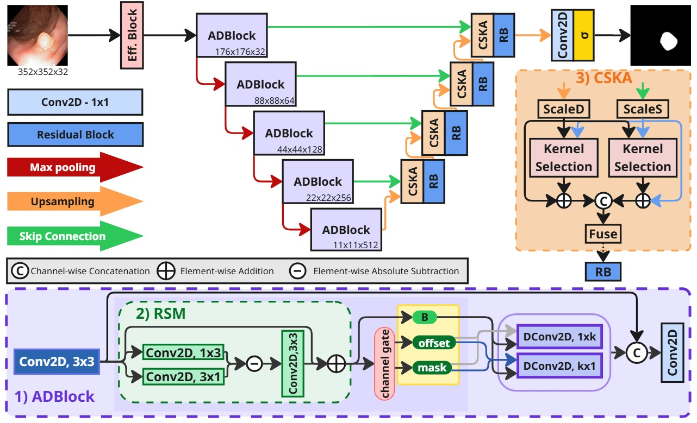
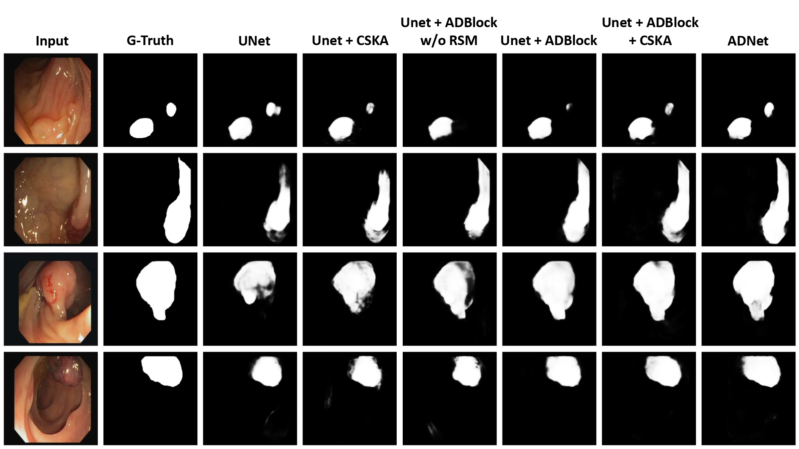

# ADNet: Anisotropic Deformable Network for Enhanced Boundary-Aware Polyp Segmentation

Official implementation of the paper accepted at ICIP 2026.

## Abstract

Automated polyp segmentation in colonoscopy images plays an essential role in the early detection and prevention of colorectal cancer, one of the leading causes of cancer-related deaths worldwide. Recent deep learning approaches have achieved remarkable segmentation accuracy, but require significant computational resources and a large number of parameters. To support real-time clinical decision making while lowering the computational burden, we propose the *Anisotropic Deformable Network* (ADNet), a lightweight polyp segmentation framework incorporating three key principles in specifically designed modules: (1) deformable strip convolutions, (2) differential feature extraction, and (3) a cross-scale kernel attention mechanism. The first two components are integrated into each encoder layer, while the last is introduced into the decoder. These modules support effective feature extraction and multi-scale interaction while maintaining low computational complexity. Extensive experiments demonstrate the competitive segmentation performance and inference time of ADNet compared to state-of-the-art approaches, while reducing memory consumption, making it suitable for efficient real-time clinical deployment.

## Architecture



## Ablation Study



## Installation

```bash
git clone https://github.com/Frico-bit/ADNet.git
cd ADNet
pip install -r requirements.txt
```

Requires Python 3.9+.

## Usage

`run.py` runs ADNet inference/evaluation over a folder of images and reports per-image and mean Dice/IoU against ground-truth masks.

A trained checkpoint (`.pth`) is required. The data folder must contain an `images/` and a `masks/` subfolder, with each mask sharing the filename (stem) of its corresponding image:

```
data_dir/
├── images/
│   ├── 1.png
│   └── 2.png
└── masks/
    ├── 1.png
    └── 2.png
```

Run the evaluation:

```bash
python run.py --checkpoint /path/to/checkpoint.pth --data_dir /path/to/data_dir --output_dir outputs
```

Arguments:

| Argument | Required | Default | Description |
|---|---|---|---|
| `--checkpoint` | yes | - | Path to a trained ADNet checkpoint. |
| `--data_dir` | yes | - | Folder containing `images/` and `masks/` subfolders. |
| `--output_dir` | no | `outputs` | Where predicted masks are saved. |
| `--img_size` | no | `352` | Input resolution the model is run at. |
| `--device` | no | `cuda` if available, else `cpu` | Device used for inference. |

Predicted masks are saved as PNGs in `--output_dir`, and Dice/IoU scores are printed to the terminal for each image along with the mean over the whole folder.

## License

This project is released under the [MIT License](LICENSE).
